# Mapa kodu Animaty

Projekty i ich zależności, kto kogo posiada w działającym programie, hierarchie klas, gniazda ciała każdego stwora oraz przebieg ticku, budowy obiektu, nauki i zapisu. Stan: krok 34. Diagramy są w Mermaid, więc GitHub rysuje je bezpośrednio w tym pliku. Przy zmianach w strukturze kodu (nowe klasy, inna własność, nowy krok budowy) aktualizuj odpowiedni diagram.

**Legenda strzałek w diagramach klas**

| Zapis | Znaczenie |
|---|---|
| `A <\|-- B` | B dziedziczy po A (klasa bazowa u grotu) |
| `A <\|.. B` | B implementuje interfejs A |
| `A *-- B` | A posiada B (zawieranie, wspólny czas życia) |
| `A o-- B` | A trzyma B, ale B żyje też poza nim |
| `A ..> B` | A używa B (zależność, bez posiadania) |
| `"*"` / `"0..1"` | liczność: wiele / co najwyżej jeden |

**Spis:** [Projekty i paczki](#projekty) · [Własność w działającym świecie](#wlasnosc) · [Własność w Studiu](#studio-wlasnosc) · [Hierarchia encji](#encje) · [Budowa obiektu: rejestr i Spawn](#budowa) · [Ciało z klocków](#cialo) · [Zmysły i napędy](#zmysly) · [Gniazda ciała każdego stwora](#gniazda) · [Mózg: moduły](#mozg) · [Stany modułów i snapshoty](#stany) · [Jeden tick](#tick) · [Nauka w tle](#nauka) · [Zapis świata i mózgu](#zapis) · [Klasy UI: panele, kontrolki, renderer](#ui)

## Projekty i paczki

Pięć projektów w `Animata.slnx`. Rdzeń nie zna UI; logika sceny Studia siedzi w osobnym projekcie bez UI, więc testy sięgają do niej bez Avalonii.

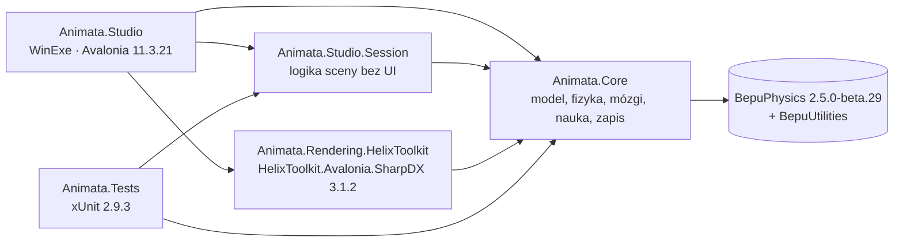

*Strzałka = odwołanie projektu (ProjectReference) albo paczki NuGet. Studio jest jedynym projektem, który widzi wszystkie pozostałe.*

## Własność w działającym świecie

Od świata w dół do części ciała i modułu mózgu. Ciało to sprzęt, mózg to oprogramowanie; mózg dotyka ciała tylko przez węzły gniazd.

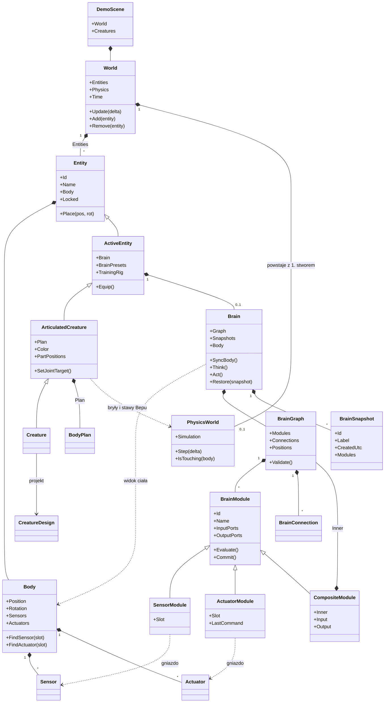

*Węzły `SensorModule` i `ActuatorModule` nie są zapisywane: `Brain.SyncBody` tworzy je z gniazd ciała (Id = MD5 z rodzaju i nazwy gniazda), tylko na najwyższym poziomie grafu.*

## Własność w Studiu

Okno trzyma sceny (sesje) i jeden stos paneli. Sesja nie wie nic o UI; panele czytają sesję i wołają jej akcje.

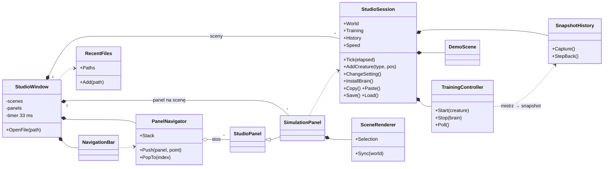

*Zegar okna woła `Tick(czas klatki)` tylko dla sceny, której panel jest na stosie; ukryta scena stoi, a jej nauka czeka między pokoleniami.*

## Hierarchia encji

Każdy obiekt świata jest `Entity`. Stwory są bryłami złożonymi z części; klocek i cylinder to statyczne bryły fizyki, kula (cel oka) fizyki nie ma.

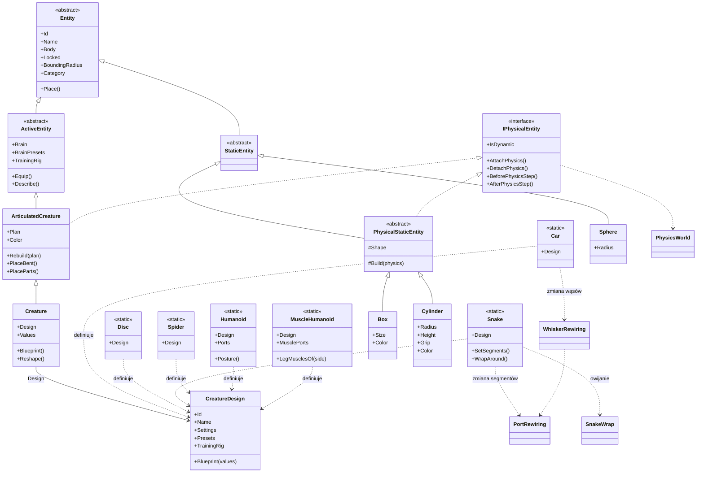

*Każdy stwór to jedna klasa `Creature` z projektem (`CreatureDesign`); autko, walec, wąż i pająk to projekty, nie klasy. Własna podklasa `ArticulatedCreature` nadal działa, ale nie jest potrzebna. Podłoga nie ma własnej klasy: to `Box` z `Locked = true`. Ustawienia — właściwości z `[Setting]` (np. `Grip`) i ustawienia projektu (np. `Segments`, `Whiskers`) — edytuje jeden wspólny edytor i zapisuje plik świata.*

## Budowa obiektu: rejestr i Spawn

Każdy obiekt powstaje jedną drogą. Rejestr zna rodzaje i ich identyfikatory w pliku; `Spawn` wykonuje kroki zawsze w tej samej kolejności.

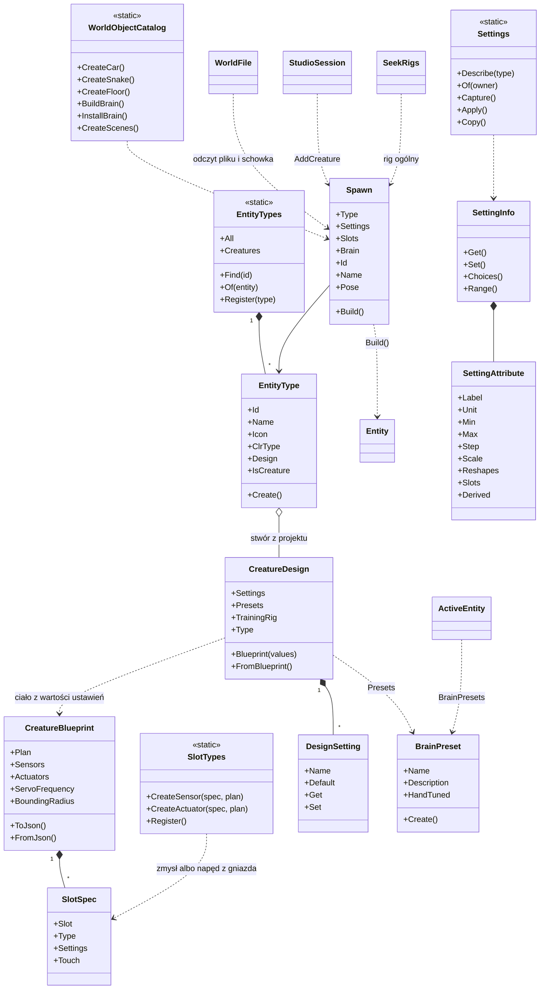

*Fabryki katalogu, plik świata, schowek, rigi nauki i Studio składają `Spawn`; nikt poza nim nie woła konstruktorów obiektów.*

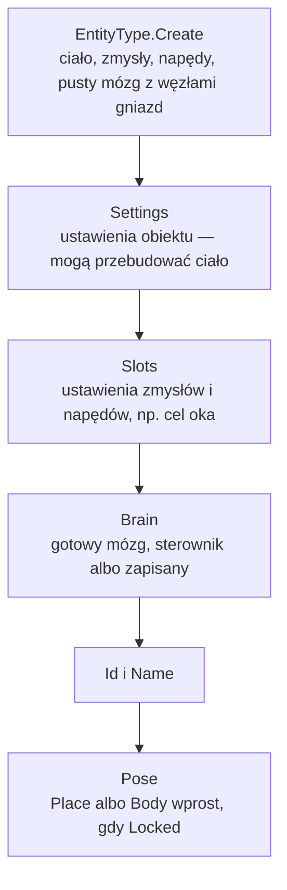

*Ustawienia gniazd idą po ustawieniach obiektu, bo np. liczba segmentów węża zmienia liczbę portów stawów.*

## Ciało z klocków

Plan ciała to dane: części i stawy. `ArticulatedCreature` zamienia go na bryły i ograniczenia Bepu.

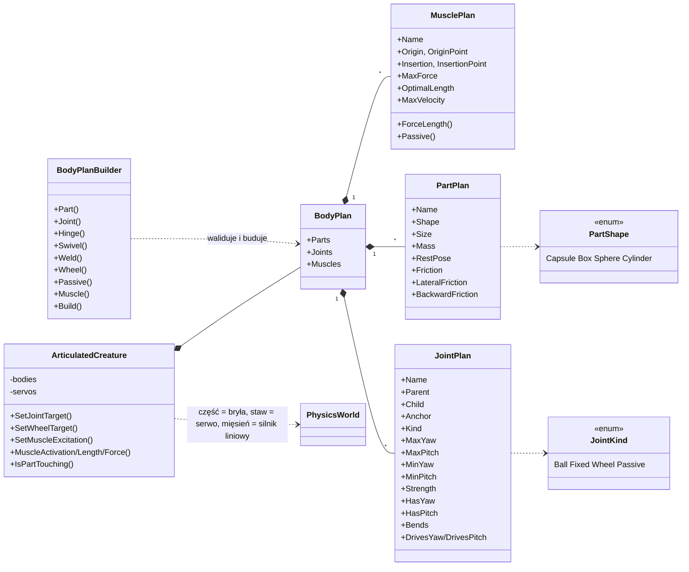

*Staw kulowy to BallSocket + AngularServo (skręt i pochylenie w osiach dziecka), z zakresem od Min do Max wokół pozy spoczynkowej — może być jednokierunkowy (kolano pająka: tylko zgięcie). Zawias (`Hinge`) i obrotnica (`Swivel`) to staw kulowy z zablokowaną jedną osią; porty kręgosłupa i czucia stawów są tylko dla ruchomych osi. Koło to zawieszenie, prowadnica, zawias i opcjonalnie silnik. Części 1–2 stawy od siebie się nie zderzają.*

*Staw bierny (`Passive`) to te same osie bez serwa: BallSocket, więzy osi (AngularHinge albo AngularSwivelHinge), ograniczniki TwistLimit wokół osi skrętu i pochylenia i tłumik kątowy (Strength = N·m·s/rad). Rusza nim mięsień: silnik liniowy (LinearAxisMotor) między przyczepami, z siłą z modelu Hilla — długość i aktywacja co krok, szybkość niejawnie w solverze (tłumik, który dąży do skracania), więc nie drga przy kroku świata 1/30 s.*

## Zmysły i napędy

Zmysł czyta świat i wystawia porty; napęd przyjmuje komendy na portach i zmienia świat w fazie Act.

```mermaid
classDiagram
  direction TB
  class Sensor {
    <<abstract>>
    +Slot
    +OutputPorts
    +Read(owner, world)
  }
  class Actuator {
    <<abstract>>
    +Slot
    +InputPorts
    +Apply(owner, commands, dt)
  }
  class TargetSensor {
    +TargetId → Found Distance Gap DirectionX/Y/Z
  }
  class RaySensor {
    +RayAngles
    +Range
    +Detects → Ray0…Rayn
  }
  class JointSensor {
    → Yaw0… Pitch0…
  }
  class ClockSensor {
    +Frequency → Sin Cos
  }
  class FeelSensor {
    +Reach → Ahead HeadPitch HeadRoll Touch
  }
  class TouchSensor {
    → port na część
  }
  class DiskDriveActuator {
    Turn Step ·
    +MaxSpeed
    +MaxTurnSpeed
    +DriveTorque
  }
  class SteeringDriveActuator {
    Steer Throttle ·
    +MaxSpeed
    +MaxReverseSpeed
    +MaxSteerAngle
    +DriveTorque
  }
  class SpineActuator {
    Yaw0… Pitch0… (stawy z serwem)
  }
  class MuscleActuator {
    pobudzenie na mięsień 0…1
  }
  class BalanceSensor {
    +Gain
    +RateGain → Pitch Roll PitchRate RollRate Height VelX VelY
  }
  class MuscleSensor {
    → Dł… Szyb… Siła… na mięsień
  }
  Sensor <|-- TargetSensor
  Sensor <|-- RaySensor
  Sensor <|-- JointSensor
  Sensor <|-- ClockSensor
  Sensor <|-- FeelSensor
  Sensor <|-- TouchSensor
  Sensor <|-- BalanceSensor
  Sensor <|-- MuscleSensor
  Actuator <|-- DiskDriveActuator
  Actuator <|-- SteeringDriveActuator
  Actuator <|-- SpineActuator
  Actuator <|-- MuscleActuator
```

*Po strzałce „→” są porty wyjściowe zmysłu; w napędach przed kropką porty komend, po niej ustawienia `[Setting]`.*

## Gniazda ciała każdego stwora

Mózg łączy się z ciałem po nazwie gniazda (`Slot`), nie po Id. Ten sam mózg pasuje do każdego ciała z tymi gniazdami i portami. Gniazda opisuje projekt ciała (`CreatureBlueprint`): nazwa, rodzaj z `SlotTypes` i ustawienia.

| Stwór | Zmysły (gniazdo: klasa) | Napędy | Gotowe mózgi | Rig nauki |
|---|---|---|---|---|
| Autko | Eye: TargetSensor · Whiskers: RaySensor (1–25, domyślnie 5) | Wheels: SteeringDriveActuator | sieć, AvoidAndSeek | CarWith(n) |
| Walec | Eye: TargetSensor | Wheels: DiskDriveActuator | sieć, sieć z ręcznymi wagami, Approach | Disk |
| Wąż | Eye: TargetSensor · Joints: JointSensor · Clock: ClockSensor (1.2 Hz) · Feel: FeelSensor | Spine: SpineActuator | sieć, CPG pełzanie, CPG toczenie | SnakeWith(n) · ClimbWith(n) |
| Pająk | Eye: TargetSensor · Joints: JointSensor (12 osi) · Clock: ClockSensor (2.5 Hz) · Feel: FeelSensor · Touch: TouchSensor | Legs: SpineActuator (12 osi: zamach, uniesienie, kolano × 4 nogi) | sieć, kłus | Spider |
| Humanoid | Eye: TargetSensor · Joints: JointSensor (18 osi) · Clock: ClockSensor (1 Hz) · Balance: BalanceSensor · Touch: TouchSensor (stopy, tułów) | Body: SpineActuator (18 osi: talia, biodra, kolana, kostki, barki, łokcie) | stój i idź (dwie sieci + automat), stój i idź ręcznie, sieć stania, stanie ręczne, chód ręczny | moduł stania: HumanoidStand · reszta: HumanoidWalk (`ModuleRig`) |
| Humanoid mięśniowy | jak Humanoid (Joints: także 12 osi biernych nóg) · MuscleSense: MuscleSensor (72 porty) | Body: SpineActuator (talia, barki, łokcie) · Muscles: MuscleActuator (24 mięśnie nóg) | stój i idź · mięśnie, stój i idź · dwie sieci, stanie mięśniami, chód mięśniami | stanie: MuscleStand · reszta: MuscleWalk (CMA-ES) |
| Nowy stwór | dowolne, w `CreatureBlueprint.Sensors` | dowolne, także kilka | `CreatureDesign.Presets` (domyślnie ogólna sieć) | `TrainingRig` ?? Generic |

## Mózg: moduły

Graf modułów połączonych port do portu. Uczą się tylko moduły z `ITrainableModule`; podgraf to moduł z własnym grafem w środku.

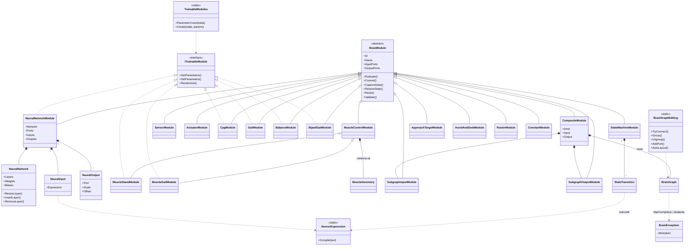

*Automat stanów (`StateMachineModule`) ma dla każdego stanu osobne wejścia „stan.port” (np. „Stoję.Pitch3”, „Idę.Pitch3”) i jedno wyjście na port. Przejścia to warunki nad portami warunków (np. `Found * Gap > 0.8`); wyjście miesza stany płynnie przez `BlendSeconds`, a nowe przejście czeka `MinDwellSeconds`. Humanoid ma tak dwie sieci: stania i chodu.*

*Graf kompiluje się leniwie: sortowanie topologiczne, porty, cykle, jedno wejście na port, każdy napęd sterowany raz. Błąd niesie Id winnego modułu, więc Studio może go podświetlić.*

## Stany modułów i snapshoty

Snapshot zapisuje stan modułów, nigdy strukturę grafu. Każdy moduł umie zamienić się w stan i z niego odtworzyć.

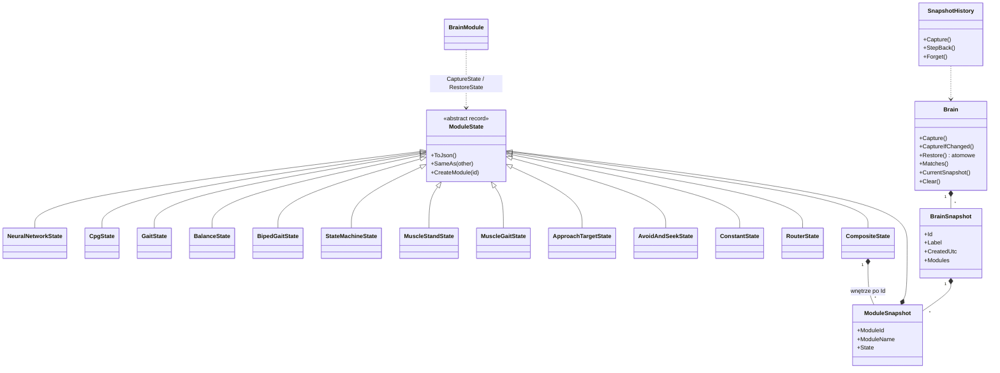

*Nowy typ modułu to rekord stanu z `CreateModule` i wpis `JsonDerivedType`. `Restore` jest atomowe: stan, który nie pasuje do grafu, niczego nie zmienia.*

## Jeden tick

Od klatki okna do kroku fizyki. Fazy idą po kolei dla wszystkich encji naraz, więc kolejność na liście nie ma znaczenia.

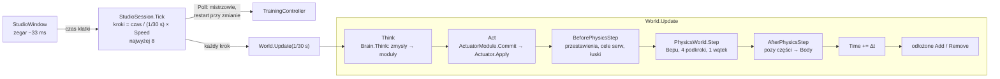

*Błąd mózgu (`BrainException`) pauzuje scenę i zostawia Id modułu do podświetlenia.*

## Nauka w tle

Stwór w scenie sam się nie uczy. Ewolucja liczy w ukrytych światach, a scena dostaje tylko wagi kolejnych mistrzów.

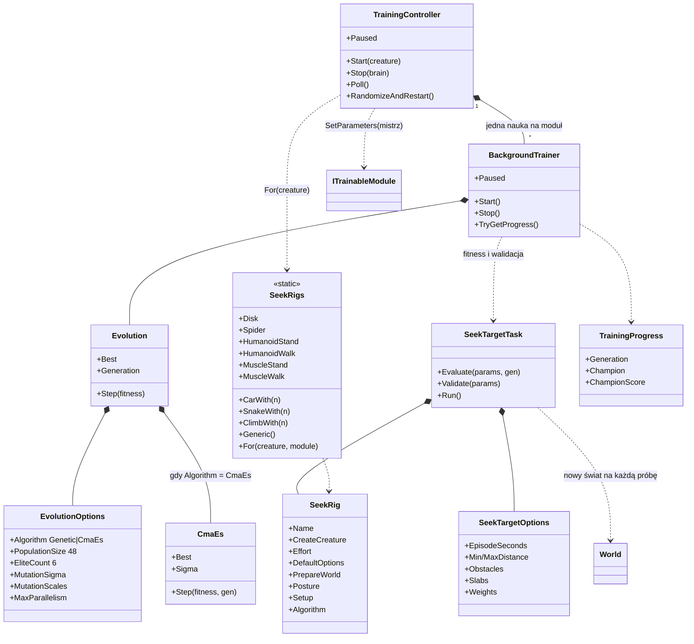

*`SeekRigs.For` kopiuje do ciał w próbach ustawienia zmysłów i napędów stwora (bez celów).*

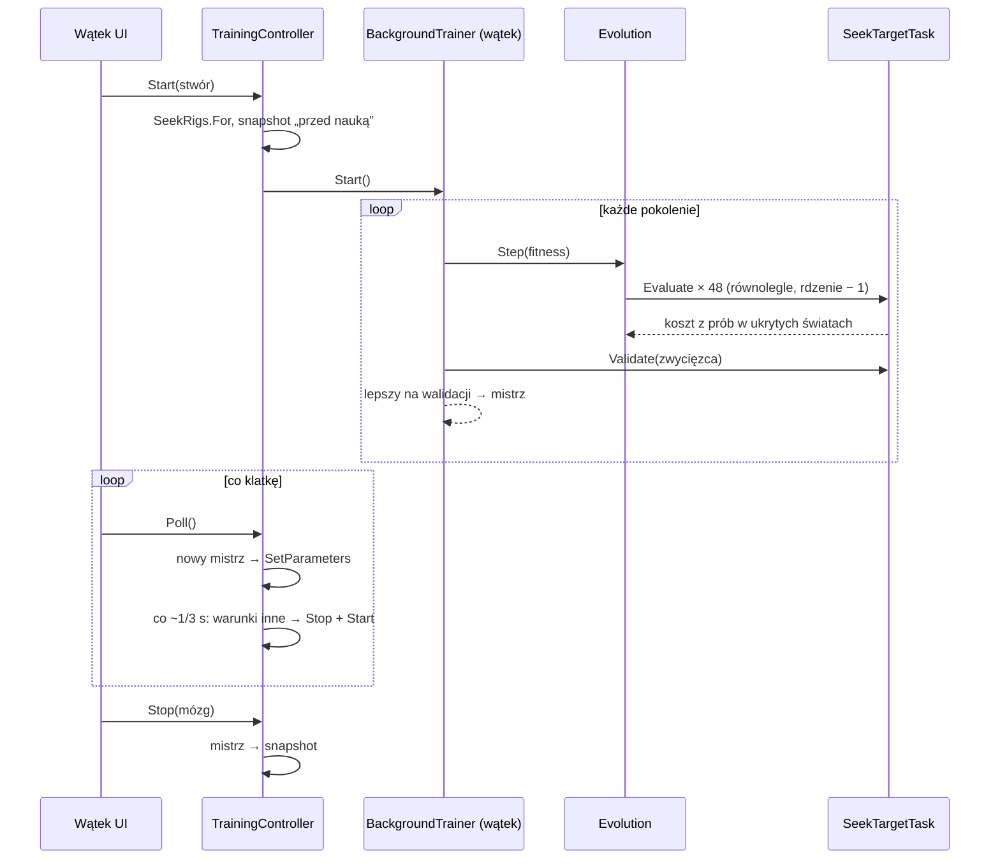

*Warunki nauki to rig, konfiguracja uczonego modułu bez parametrów i ustawienia gniazd bez celów.*

## Zapis świata i mózgu

Dwa formaty JSON: świat (`*.animata.json`, format 5) i sam mózg (`*.brain.json`, format 2). Odczyt świata idzie przez `Spawn`.

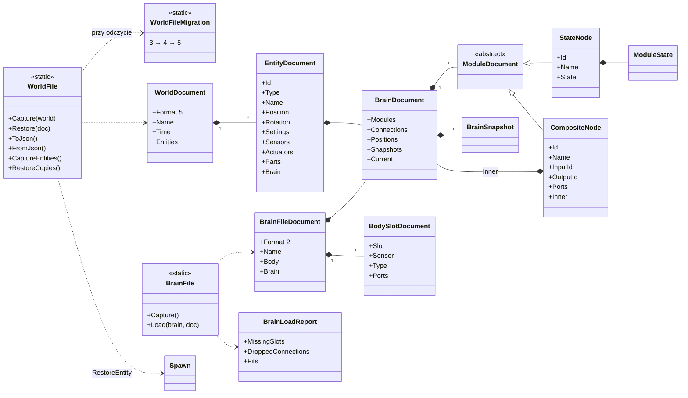

*Węzły gniazd ciała nie trafiają do pliku; po odczycie odtwarza je `SyncBody`. Stan chwilowy (faza CPG, prędkości, pamięć sterowników) się nie zapisuje.*

## Klasy UI: panele, kontrolki, renderer

Budowa w kodzie, bez XAML. Panel to jeden poziom nawigacji wgłąb; kontrolki rysowane ręcznie przemalowują się po zmianie motywu.

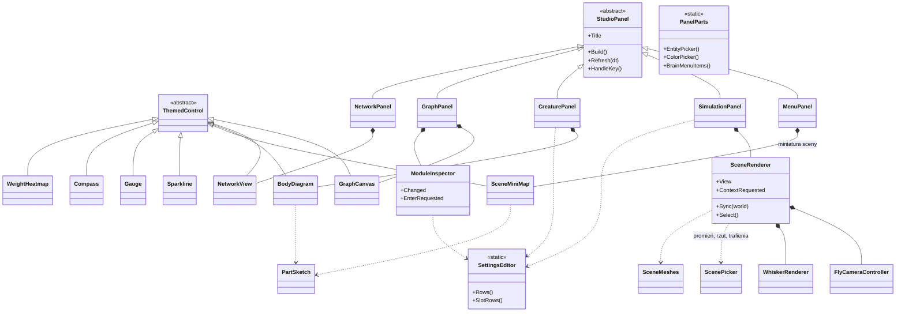

*Ścieżka nawigacji: Menu → Scena → stwór → Mózg → podgraf… albo sieć. Pasek nawigacji należy do okna, więc w przejściu lecą tylko panele.*

---

161 typów w 4 projektach produkcyjnych (bez testów). Diagramy pomijają rekordy pomocnicze (`SeekEpisode`, `SlabSpec`, `ObstacleSpec`, `EpisodeResult`, `BrainContext`) i klasy narzędziowe UI (`Ui`, `Icons`, `Dialogs`, `WorldFiles`, `BrainFiles`, `StudioTheme`).
